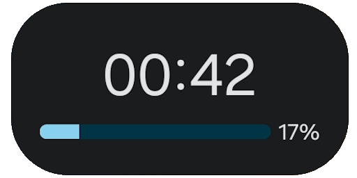
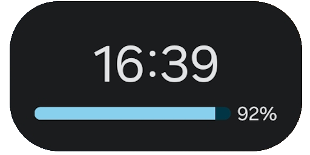
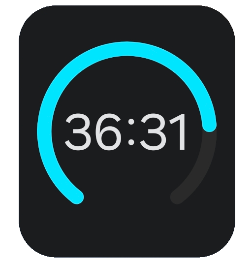
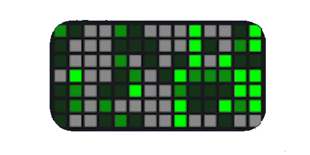

# HackWidgets

[Hackatime](https://hackatime.hackclub.com/) widgets for android.

## Features

- Today widget:
  Shows your coding time today + progress toward a daily goal  
  

- Weekly widget:
  Shows your coding time weekly (last 7 days or current week) + progress toward a daily goal  
  

- Circular widget:
  Shows your coding time over a custom period + progress toward a goal  
  

- Streak widget:
  Shows how many days you've been coding more than 30 minutes in a row  
  

- Heatmap widget:
  Shows a GitHub-like heatmap of the coding you've done
  